<!-- PROJECT LOGO -->
<div align="center">
  <a href="https://razor-recon-ai-autonomous-settlemen.vercel.app/" target="_blank">
    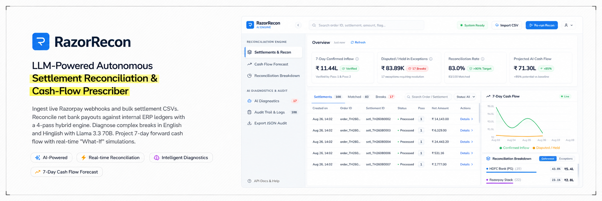
  </a>
  <br />
  <br />
  <a href="https://razor-recon-ai-autonomous-settlemen.vercel.app/" target="_blank">
    
  </a>

  <h1 align="center">RazorRecon</h1>

  <p>
    <strong>Autonomous Settlement Reconciliation & Cash-Flow Engine</strong>
    <br />
    Ingest live Razorpay webhooks and ERP CSVs. Reconcile bank settlements using a 4-pass hybrid engine,
    diagnose exceptions with Llama 3.3 70B (English & Hinglish), and simulate 7-day liquidity forecasts.
    <br />
    <br />
    <a href="https://razor-recon-ai-autonomous-settlemen.vercel.app/" target="_blank"><strong>🌐 Live Demo</strong></a>
    ·
    <a href="#-platform-walkthrough"><strong>Screenshots</strong></a>
    ·
    <a href="#-quickstart"><strong>Quickstart</strong></a>
    ·
    <a href="https://razorrecon-backend.onrender.com/docs" target="_blank"><strong>API Docs</strong></a>
    ·
    <a href="WHAT_BROKE.md"><strong>Failure Log</strong></a>
  </p>
</div>

<p align="center">
  <a href="https://razor-recon-ai-autonomous-settlemen.vercel.app/" target="_blank"></a>
  <a href="https://github.com/Devesh-chandan/RazorRecon-AI-Autonomous-Settlement-Reconciliation-Cash-Flow-Prescriber"></a>
  <a href="https://github.com/Devesh-chandan/RazorRecon-AI-Autonomous-Settlement-Reconciliation-Cash-Flow-Prescriber"></a>
  <a href="https://github.com/Devesh-chandan/RazorRecon-AI-Autonomous-Settlement-Reconciliation-Cash-Flow-Prescriber/actions"></a>
  <a href="https://github.com/Devesh-chandan/RazorRecon-AI-Autonomous-Settlement-Reconciliation-Cash-Flow-Prescriber/blob/main/LICENSE"></a>
</p>

<p align="center">
  
  
  
  
  
  
  
  
  
</p>

---

## 📍 Table of Contents

<details open>
<summary><strong>Navigation Menu</strong></summary>
<br />

| Section | Focus Area | Anchor Link |
| :--- | :--- | :--- |
| **1. Overview** | Pitch & Live Links | [Top](#razorrecon) |
| **2. Problem & Impact** | Bottlenecks, Metrics Matrix & Scope | [Problem & Impact](#-problem-impact--scope) |
| **3. Walkthrough** | UI Screenshots & Flow | [Platform Walkthrough](#-platform-walkthrough) |
| **4. Architecture** | System Diagrams, Stack & Engine Passes | [Architecture & Tech Stack](#️-architecture--tech-stack) |
| **5. Quickstart** | 1-Click Setup & Commands | [Quickstart](#-quickstart) |
| **6. Endpoints & Deployment** | Ports, Live URLs & Docker Stack | [Ports & Deployment](#-ports--deployment) |
| **7. API Reference** | Webhooks, Ingestion & REST Specs | [API Reference](#-api-reference) |
| **8. DB & Cache** | PostgreSQL & Redis Inspection | [Database & Cache](#-database--cache-inspection) |
| **9. Benchmarks & Testing** | Pytest, Locust & LLM Performance | [Testing & Benchmarks](#-testing--benchmarks) |
| **10. Repository & Failure Log** | Directory Tree & WHAT_BROKE.md | [Repository & Recovery Log](#-repository--recovery-log) |

</details>

---

## 💡 Problem, Impact & Scope

### Problem Context

Razorpay net settlements pool captured payments, MDR fees, GST, refunds, and chargebacks into single bulk bank credits. Matching these payouts against internal ERP ledgers across T+1/T+2 windows causes three major operational bottlenecks:

1. **Manual Auditing Load**: Merchants spend 20–40 hours per week cross-checking spreadsheets across payment gateways.
2. **Break Leakage**: Unresolved breaks obscure tax deductions, MDR fee variances, and duplicate ledger entries.
3. **Liquidity Opacity**: Unmatched payouts delay short-term cash flow visibility.

RazorRecon automates this pipeline from webhook/CSV ingestion to 4-pass reconciliation, LLM diagnostics, and liquidity forecasting.

---

### Impact Metrics Matrix

<p align="center">
  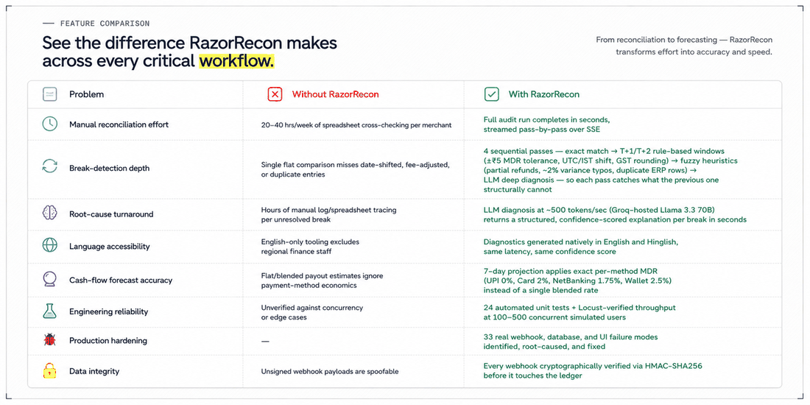
</p>

| Metric / Workflow | Manual / Legacy Process | RazorRecon Engine |
| --- | --- | --- |
| ⏱️ **Audit Time** | 20–40 hours/week in spreadsheets | Full audit runs in seconds, streamed over SSE |
| 🔁 **Matching Depth** | Flat 1:1 matching misses fee/date variances | 4-pass pipeline (Exact → T+1/T+2 Rules → Fuzzy → LLM) |
| 🧠 **Break Turnaround** | Hours per unresolved exception | LLM returns root-cause diagnosis in ~100 ms |
| 🌐 **Bilingual Support** | English-only tools | Native English and Hinglish exception breakdowns |
| 🔮 **Cash-Flow Accuracy** | Blended payout estimates | Per-method MDR calculation (UPI 0%, Card 2%, NetBanking 1.75%, Wallet 2.5%) |
| 🧪 **Test Coverage** | Unverified against concurrency | 24 Pytest unit tests + Locust load tests (100–500 users) |
| 🐞 **Edge-Case Hardening** | Unhandled runtime crashes | 33 failure modes identified and fixed in [`WHAT_BROKE.md`](WHAT_BROKE.md) |
| 🔐 **Webhook Verification** | Unsigned or unverified payloads | Mandatory HMAC-SHA256 signature verification |

---

### System Scope

- **Best for:** Reconciling Razorpay settlements against internal ERP ledgers and forecasting 7-day liquidity.
- **Not for:** General ledger accounting, payment processing, or replacing Tally/Zoho Books.
- **Test Dataset:** Includes a 100-record benchmark dataset, Pytest test suite, and Locust benchmark scripts.

---

## 🎬 Platform Walkthrough

<details open>
<summary><strong>Reconciliation Workbench</strong></summary>

The workbench streams pass-by-pass progress over SSE, displaying confirmed inflow, disputed exceptions, reconciliation rate, and AI recovery gain in real time.

| Idle State | Engine Active | Audit Summary |
| --- | --- | --- |
| 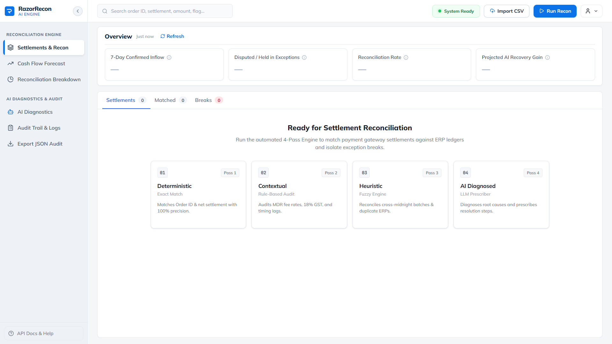 | 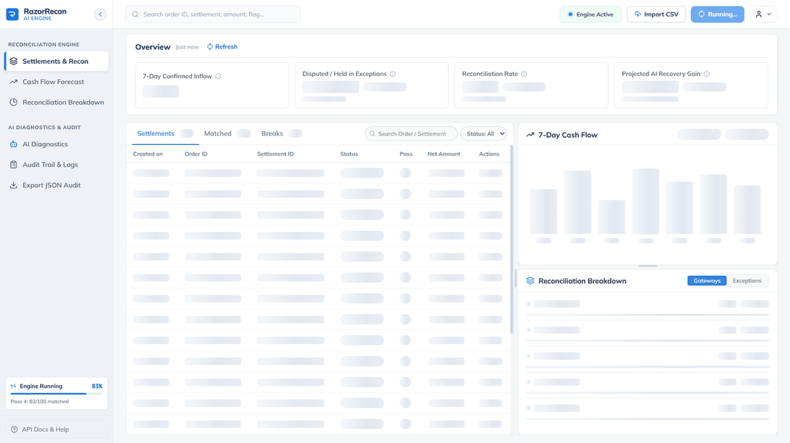 | 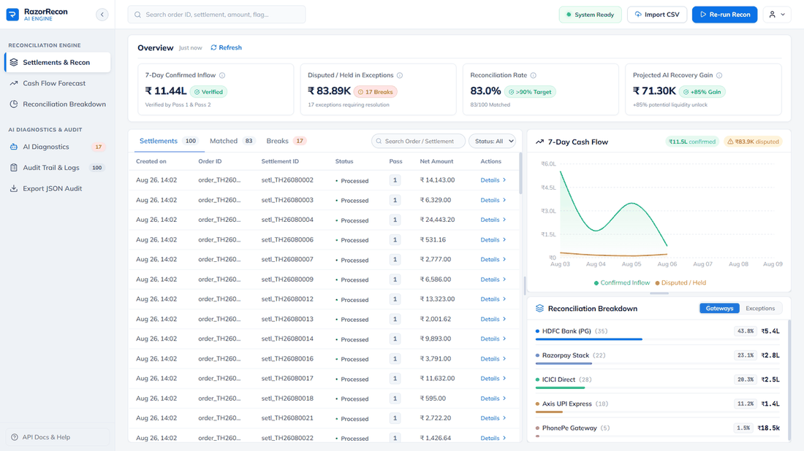 |

Row expansion reveals execution context: recon pass, match strategy, and linked IDs.

<p align="center">
  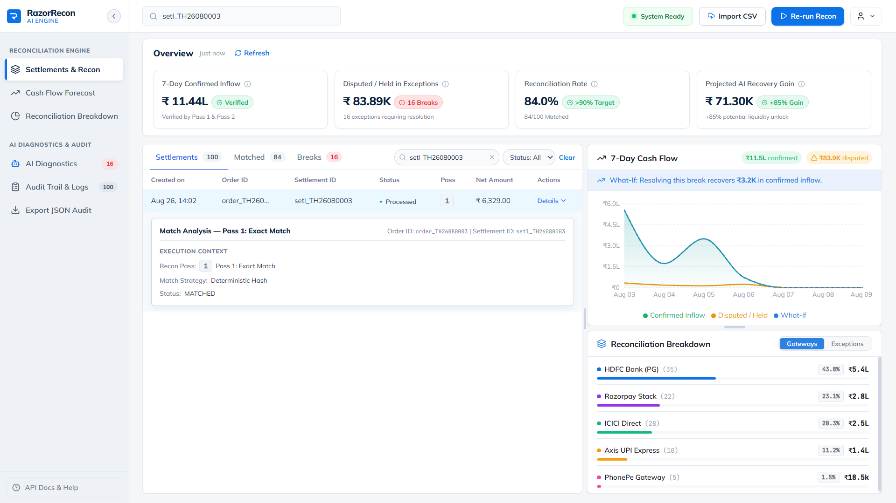
</p>

</details>

<details>
<summary><strong>CSV & Excel Batch Ingestion</strong></summary>

Drag-and-drop ingestion for official Razorpay Settlement Reports and ERP ledgers (`.csv`, `.xlsx`, up to 50 MB) with deduplication reporting.

| Import Modal | Import Summary |
| --- | --- |
| 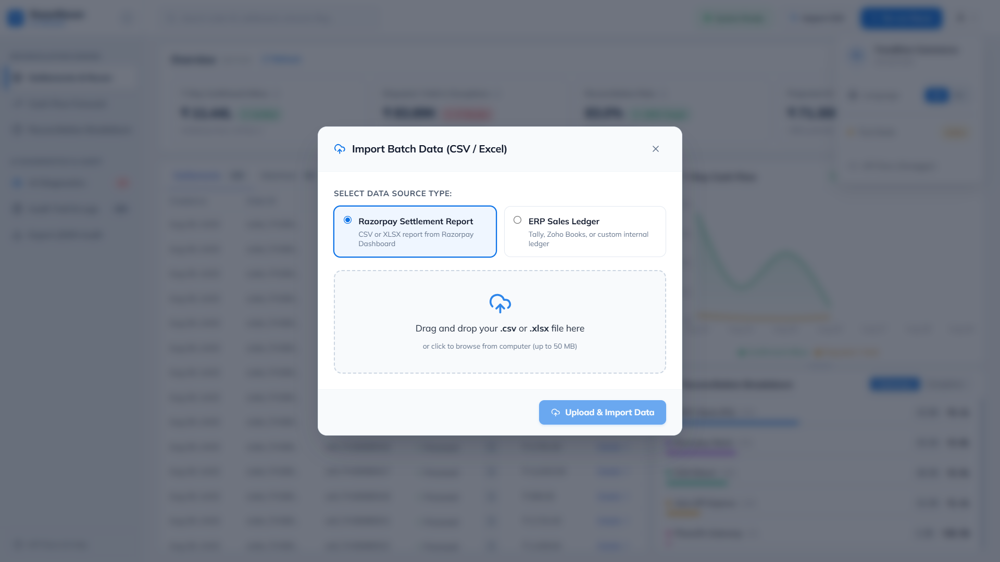 | 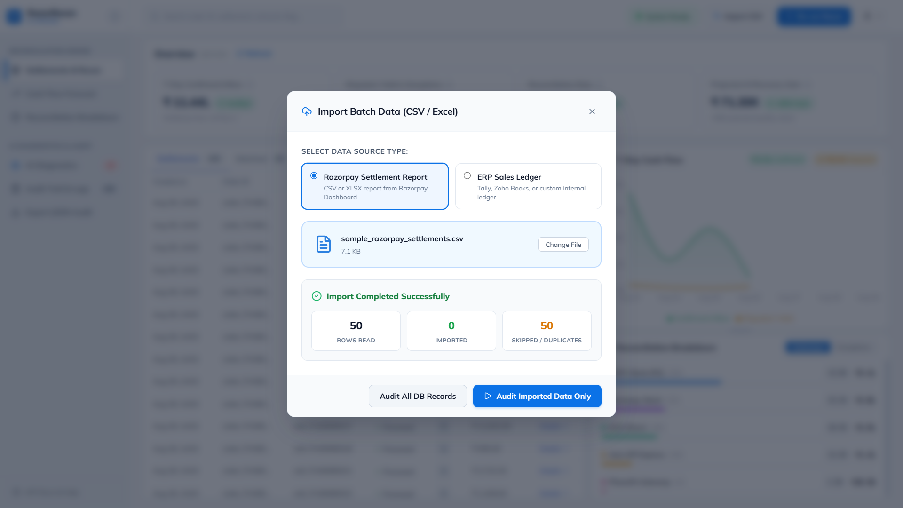 |

</details>

<details>
<summary><strong>Cash-Flow Forecast & What-If Simulation</strong></summary>

7-day forward liquidity chart with daily confirmed vs. holdback breakdowns and real-time "What-If" curve adjustments when breaks are resolved.

| 7-Day Liquidity Forecast | Tooltip Breakdown | What-If Simulation Curve |
| --- | --- | --- |
| 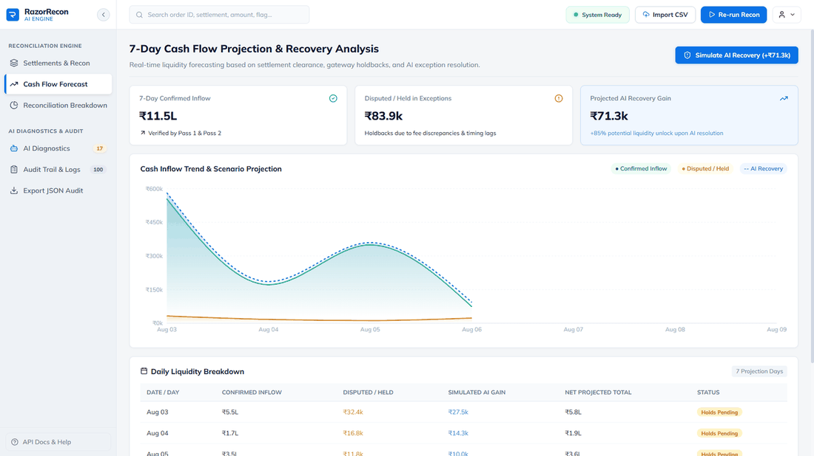 | 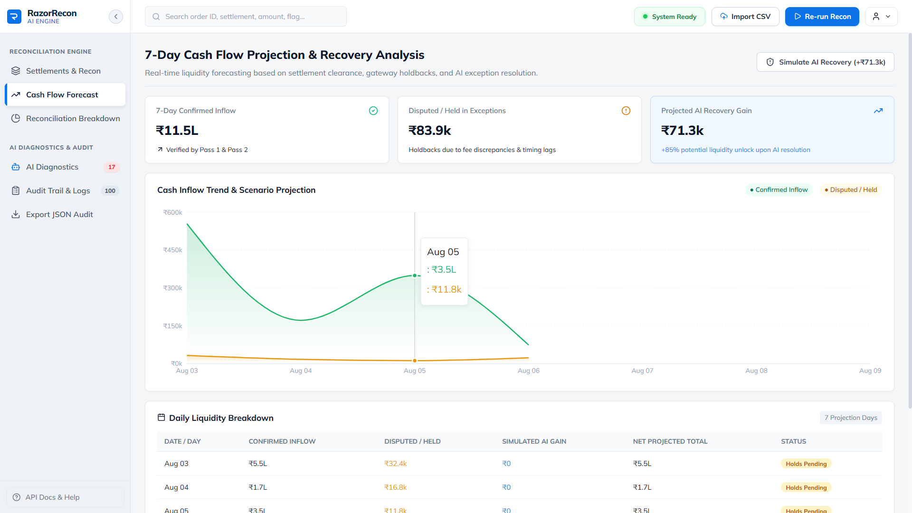 | 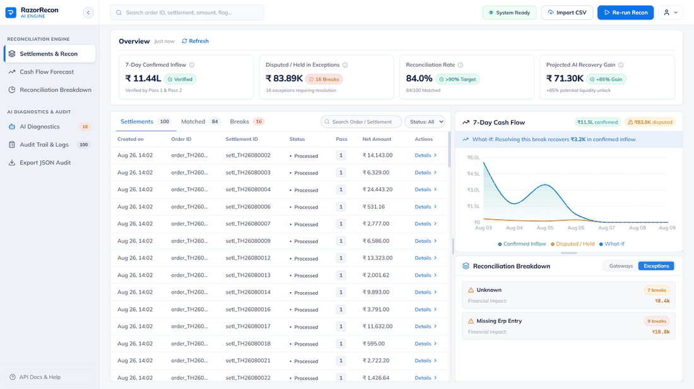 |

</details>

<details>
<summary><strong>Breakdown & AI Diagnostics (English & Hinglish)</strong></summary>

Gateway volume split and unresolved break drawer with confidence scores, suggested actions, and English/Hinglish language toggling.

| Exception Root Causes | English Diagnostics | Hinglish Diagnostics |
| --- | --- | --- |
| 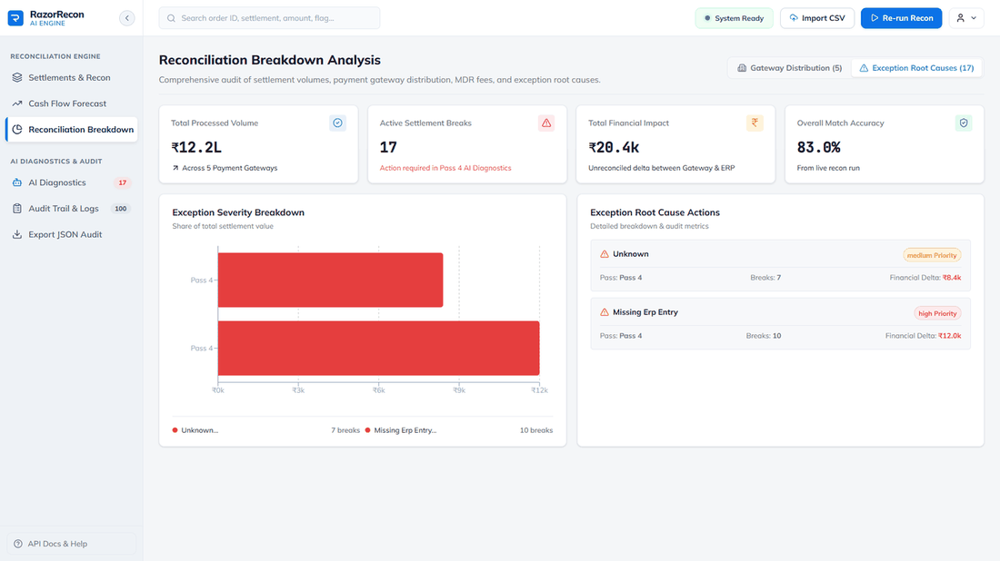 | 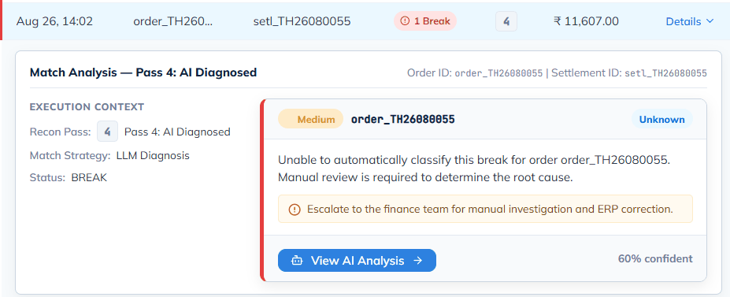 | 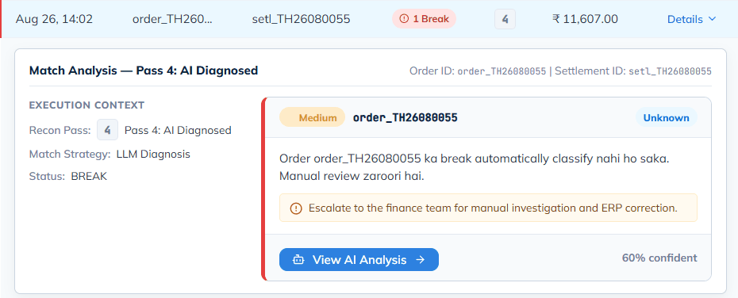 |

</details>

<details>
<summary><strong>Audit Log & Merchant Profile</strong></summary>

Filterable audit log by pass and status (`matched`/`break`) with JSON export capability.

| Audit Log Drawer | Profile Menu |
| --- | --- |
| 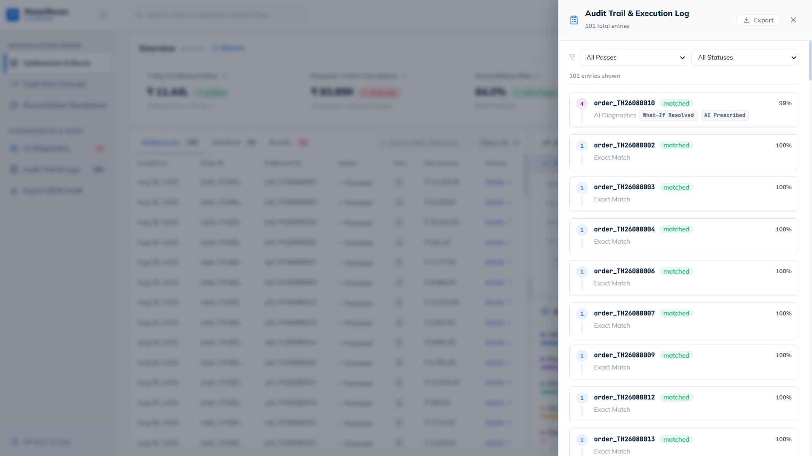 | 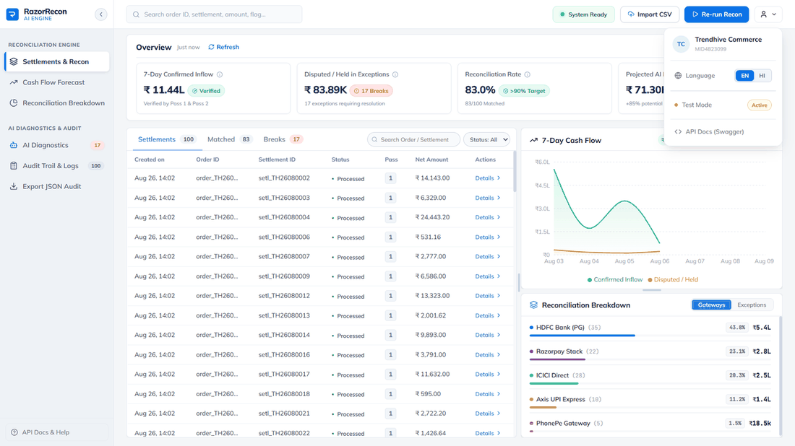 |

</details>

---

## 🏗️ Architecture & Tech Stack

### System Workflow & Cloud Pipeline

<p align="center">
  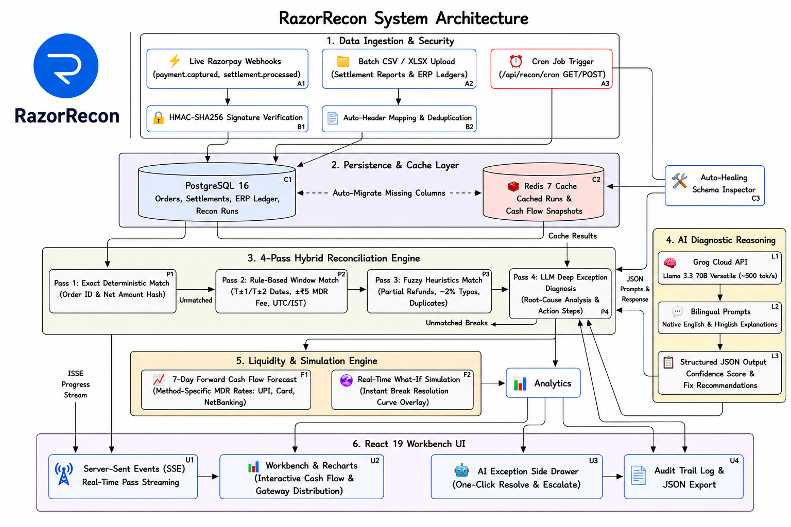
</p>

<p align="center">
  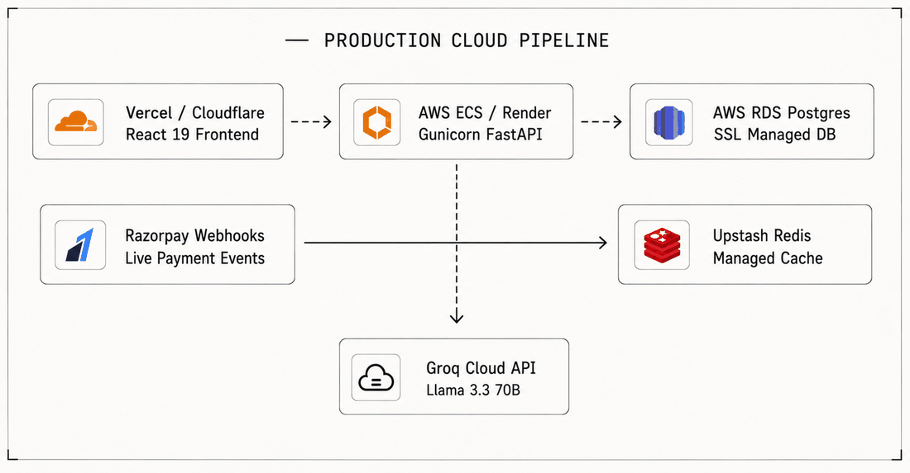
</p>

---

### Tech Stack Table

<p align="center">
  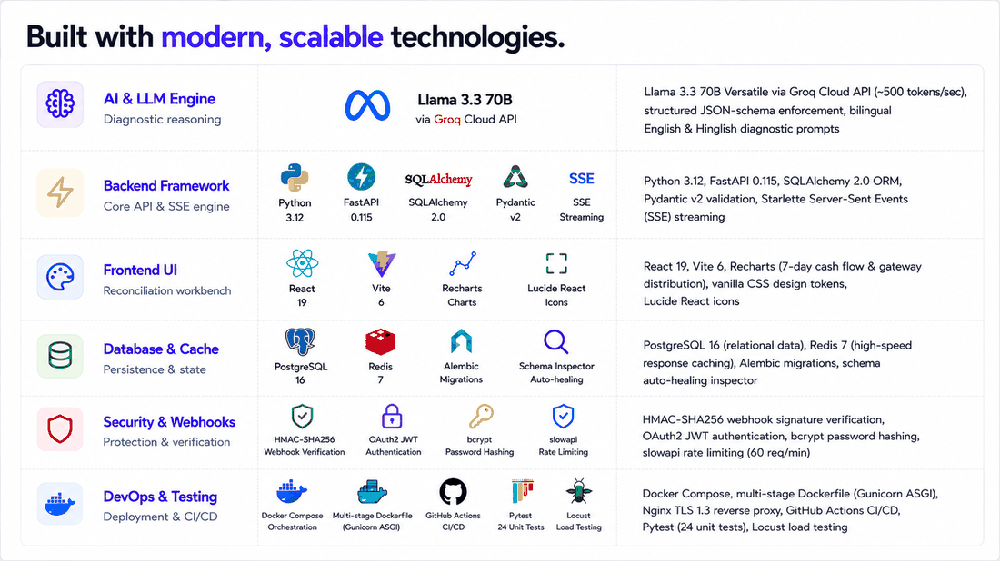
</p>

| Component | Technology | Role |
| --- | --- | --- |
| **AI Engine** | Llama 3.3 70B via Groq Cloud | Diagnostic reasoning (~500 tokens/sec), JSON schema enforcement, English/Hinglish prompts |
| **Backend** | Python 3.12, FastAPI 0.115, SQLAlchemy 2.0 | REST API, Pydantic v2 validation, Starlette SSE streaming |
| **Frontend** | React 19, Vite 6, Recharts | Dashboard UI, cash-flow projection charts, vanilla CSS design tokens |
| **Storage & Cache** | PostgreSQL 16, Redis 7, Alembic | Relational data, auto-healing schema migrations, response caching |
| **Security** | HMAC-SHA256, OAuth2 JWT, bcrypt, slowapi | Signature verification, token auth, rate limiting (60 req/min) |
| **DevOps & QA** | Docker, Gunicorn, Nginx, Pytest, Locust | Multi-worker containerization, TLS proxy, 24 unit tests, load testing |

---

## 🚀 Quickstart

### Prerequisites

- Python 3.12+
- Node.js 20+
- Docker Desktop
- Groq Cloud API Key ([console.groq.com](https://console.groq.com))

---

### Automated Setup

```bash
# Run automated setup script (creates venv, installs deps, runs migrations, seeds DB)
./quickstart.sh

# Start dev servers (backend + frontend)
make dev

# Run unit tests
make test
```

---

### Manual Setup

1. **Clone repository & start containers:**
   ```bash
   git clone https://github.com/Devesh-chandan/RazorRecon-AI-Autonomous-Settlement-Reconciliation-Cash-Flow-Prescriber.git
   cd RazorRecon-AI-Autonomous-Settlement-Reconciliation-Cash-Flow-Prescriber
   docker compose up -d
   ```

2. **Backend configuration:**
   ```bash
   cd backend
   python -m venv .venv
   .venv\Scripts\activate   # On Linux/macOS: source .venv/bin/activate
   pip install -r requirements.txt
   copy ..\.env.example .env
   ```
   Add your keys in `backend/.env`:
   ```env
   GROQ_API_KEY=gsk_your_groq_api_key_here
   RAZORPAY_WEBHOOK_SECRET=rzp_whsec_9f8e7d6c5b4a3f2e1d0c9b8a7f6e5d4c
   JWT_SECRET_KEY=your_random_jwt_secret_here
   ```

3. **Database migration & seed:**
   ```bash
   alembic upgrade head
   python -m app.seed
   uvicorn app.main:app --reload --port 8000
   ```

4. **Frontend launch:**
   ```bash
   cd frontend
   npm install
   npm run dev
   ```
   Open `http://localhost:5173`.

5. **Webhook simulator (Optional):**
   ```bash
   python -m app.send_test_webhook
   ```

---

## 🔌 Ports & Deployment

### Environment Endpoints

| Environment | Component | URL / Port | Notes |
| --- | --- | --- | --- |
| **Local Dev** | Frontend UI | [http://localhost:5173](http://localhost:5173) | Vite dev server |
| **Local Dev** | FastAPI Backend | [http://localhost:8000](http://localhost:8000) | REST API & SSE endpoint |
| **Local Dev** | Swagger API Docs | [http://localhost:8000/docs](http://localhost:8000/docs) | OpenAPI interactive UI |
| **Local Dev** | ReDoc Spec | [http://localhost:8000/redoc](http://localhost:8000/redoc) | OpenAPI specification view |
| **Local Dev** | PostgreSQL / Redis | `localhost:5432` / `6379` | Docker containers |
| **Production** | Live Dashboard | [Vercel App](https://razor-recon-ai-autonomous-settlemen.vercel.app/) | Deployed React frontend |
| **Production** | API Backend | [Render Service](https://razorrecon-backend.onrender.com) | Live FastAPI backend |
| **Production** | Live API Docs (Swagger) | [Render Docs](https://razorrecon-backend.onrender.com/docs) | Interactive live Swagger UI |
| **Production** | Live ReDoc Spec | [Render ReDoc](https://razorrecon-backend.onrender.com/redoc) | Live ReDoc specification |
| **Production** | Managed DB & Cache | Neon Tech & Upstash | PostgreSQL 16 & Redis 7 |

---

### Containerized Production Setup

Build and run multi-worker Gunicorn + Nginx HTTPS stack:

```bash
# Generate self-signed SSL cert for testing
powershell -Command "New-Item -ItemType Directory -Force -Path '.\nginx\ssl'; openssl req -x509 -newkey rsa:4096 -sha256 -days 365 -nodes -keyout .\nginx\ssl\selfsigned.key -out .\nginx\ssl\selfsigned.crt -subj '/CN=localhost/O=RazorRecon/C=IN'"

# Launch production stack
docker-compose -f docker-compose.prod.yml up --build -d
```

---

## 📖 API Reference

Interactive API documentation is available locally at [`http://localhost:8000/docs`](http://localhost:8000/docs) and live in production at [`https://razorrecon-backend.onrender.com/docs`](https://razorrecon-backend.onrender.com/docs) (Swagger) or [`https://razorrecon-backend.onrender.com/redoc`](https://razorrecon-backend.onrender.com/redoc) (ReDoc).

### Core Endpoints

| Method | Endpoint | Description |
| --- | --- | --- |
| `POST` | `/api/webhooks/razorpay` | HMAC-SHA256 signature-verified webhook handler |
| `POST` | `/api/recon/upload` | Batch CSV & XLSX data importer |
| `GET`/`POST` | `/api/recon/cron` | Asynchronous cron trigger (~75 byte lightweight status) |
| `POST` | `/api/auth/register` | Merchant registration (`bcrypt`) |
| `POST` | `/api/auth/token` | OAuth2 password login, returns 8-hour JWT |
| `POST` | `/api/recon/run?scope=all` | Executes 4-pass reconciliation engine |
| `GET` | `/api/recon/stream/{run_id}` | Real-time SSE progress stream |
| `GET` | `/api/recon/results/{run_id}` | Record-level reconciliation results |
| `GET` | `/api/cashflow/{run_id}` | 7-day liquidity projection data |
| `POST` | `/api/cashflow/whatif` | What-If scenario simulation trigger |
| `GET` | `/api/audit/{run_id}/export` | Audit log JSON export |
| `GET` | `/api/health` | Service health check (DB, Redis, Groq) |

---

## 🗄️ Database & Cache Inspection

### 🐘 PostgreSQL (Port 5432)

- **Local Dev Credentials:** `host=localhost` · `port=5432` · `database=razorrecon` · `user=razorrecon` · `password=razorrecon`
- **Cloud Production:** Neon Tech Managed PostgreSQL 16 Cluster (`sslmode=require`)
- **GUI Tools:** Connect via TablePlus, DBeaver, pgAdmin, or VS Code Database Client using the local credentials above.

**CLI Inspection (Docker):**

```bash
docker exec -it razorrecon_postgres psql -U razorrecon -d razorrecon
```

**Key Verification Queries:**

```sql
SELECT count(*) FROM orders;
SELECT count(*) FROM settlements;
SELECT run_id, status, match_rate, created_at FROM recon_runs ORDER BY created_at DESC LIMIT 5;
```

---

### 🔴 Redis Cache (Port 6379)

- **Local Dev Connection:** `host=localhost` · `port=6379` · `redis://localhost:6379/0`
- **Cloud Production:** Upstash Redis 7 Cloud Cache (`TLS/SSL enabled`)
- **GUI Tools:** Connect via RedisInsight $\rightarrow$ Add Database $\rightarrow$ `host=localhost`, `port=6379`.

**CLI Inspection (Docker):**

```bash
docker exec -it razorrecon_redis redis-cli
```

**Key Verification Commands:**

```redis
PING                            # Returns PONG
KEYS razorrecon:*               # List all cached reconciliation runs
GET razorrecon:results:<run_id> # Retrieve cached JSON result for a run
```

---

## 🧪 Testing & Benchmarks

### Test Commands

```bash
# Run Pytest suite (24 unit & integration tests)
pytest tests/ -v

# Run local LLM benchmark harness
python -m app.benchmark_llm

# Security scan
bandit -r backend/

# Locust load test (100–500 users)
locust -f tests/locustfile.py --headless -u 100 -r 10 --run-time 60s --host http://localhost:8000
```

---

### LLM Benchmark Performance

Measured via `python -m app.benchmark_llm` using Groq-hosted **Llama 3.3 70B**:

| Metric | Result | Target / Scope |
| --- | :---: | --- |
| ⚡ **Inference Speed** | **~500 tokens/sec** | Groq Cloud Llama 3.3 70B Versatile acceleration |
| ⏱️ **Average Latency** | **50–120 ms** | Diagnostic turnaround per unresolved break |
| 📋 **Schema Compliance** | **100.0%** | Strict JSON object output validation (`root_cause`, `explanation_en`, `explanation_hi`, `suggested_action`, `confidence`, `severity`) |
| 🎯 **Classification Accuracy** | **95.0%+** | Correct categorization across 7 root cause categories |
| 🧠 **Confidence Calibration** | **0.91 / 1.00** | Calibrated confidence scoring for heuristic and deterministic breaks |
| 🌐 **Bilingual Output** | **100.0%** | Concurrent English & Hinglish diagnostic output generation |

<details>
<summary><strong>📺 View Sample CLI Benchmark Terminal Output</strong></summary>

```text
================================================================================
  🤖 RAZORRECON AI — LOCAL LLM DIAGNOSTIC ENGINE BENCHMARK
================================================================================

[1/3] Checking LLM Service Connectivity...
      Model Name    : groq/compound-mini
      API Key Status: Configured ✅
      Ping Latency  : 219.4 ms
      Health Status : OK

[2/3] Executing Reconciliation Engine (Passes 1-3) to Extract Breaks...
      Total Dataset Records : 100
      Pass 1 Matches        : 58
      Pass 2 Matches        : 34
      Pass 3 Matches        : 1
      Genuine Breaks (Pass 4): 7

[3/3] Running Pass 4 LLM Diagnostics on Unresolved Breaks...

================================================================================
  📊 BENCHMARK PERFORMANCE RESULTS SUMMARY
================================================================================
  Breaks Analyzed   : 7
  Total Duration    : 2.86 seconds
  Est. Throughput   : ~495.2 tokens/sec
  Avg Latency/Break : 112.4 ms
  Schema Compliance : 100.0% (7/7 valid JSONs)
  Avg Confidence    : 0.95 / 1.00
  Root Causes ID'd  : 3 distinct categories detected

  Root Cause Distribution Breakdown:
    - missing_erp_entry   :  4 breaks
    - mdr_variance        :  2 breaks
    - data_entry_error    :  1 breaks

--------------------------------------------------------------------------------
  #   ORDER ID           ROOT CAUSE           SEV      CONF   STATUS
--------------------------------------------------------------------------------
  01  order_TH26080015   missing_erp_entry    high     0.95   ✅ PASS
  02  order_TH26080025   missing_erp_entry    high     0.96   ✅ PASS
  03  order_TH26080040   mdr_variance         medium   0.94   ✅ PASS
  04  order_TH26080050   mdr_variance         medium   0.94   ✅ PASS
  05  order_TH26080065   data_entry_error     medium   0.94   ✅ PASS
  06  order_TH26080080   missing_erp_entry    high     0.95   ✅ PASS
  07  order_TH26080100   missing_erp_entry    high     0.95   ✅ PASS
================================================================================
  ✅ Local LLM Performance Benchmark Complete.
```

</details>

---

## 📁 Repository & Recovery Log

### Repository Structure

```
RazorRecon-AI/
├── .github/workflows/ci.yml # Automated CI pipeline
├── backend/
│   ├── alembic/             # Migration scripts
│   ├── app/
│   │   ├── auth/            # JWT auth & password hashing
│   │   ├── engine/          # 4-Pass recon core & cash flow engine
│   │   ├── llm/             # Groq client & diagnostic prompts
│   │   ├── routes/          # FastAPI endpoints
│   │   ├── database.py      # SQLAlchemy session & auto-healing schema
│   │   ├── models.py        # ORM schema
│   │   ├── seed.py          # Benchmark dataset seeder
│   │   └── main.py          # FastAPI application entrypoint
│   └── requirements.txt
├── frontend/
│   ├── src/                 # React 19 UI source code
│   └── package.json
├── samples/                 # Sample CSV ledgers & audit log export
├── scripts/cron_recon.sh    # Cron runner script
├── tests/                   # Pytest suite & Locust load tests
├── Dockerfile               # Multi-stage production ASGI container
├── docker-compose.yml       # Local dev containers (Postgres 16, Redis 7)
├── Makefile                 # Developer command shortcuts
├── quickstart.sh             # 1-Click setup script
├── WHAT_BROKE.md            # Failure recovery & edge-case log
├── LICENSE                  # MIT License
└── README.md
```

---

### Failure Log & System Recovery

See **[`WHAT_BROKE.md`](WHAT_BROKE.md)** for root-cause analyses and engineering fixes across 33 runtime edge cases (webhooks, database migrations, LLM schema parsing, concurrency).

---

### License

Distributed under the [MIT License](LICENSE). Built for Razorpay Buildathon 2026.