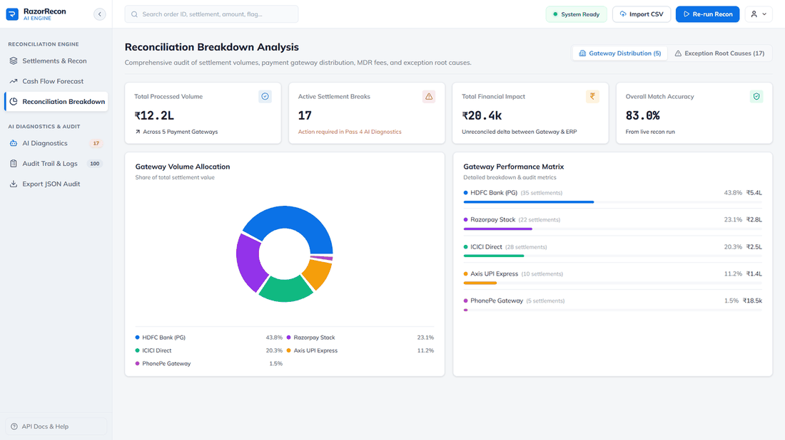
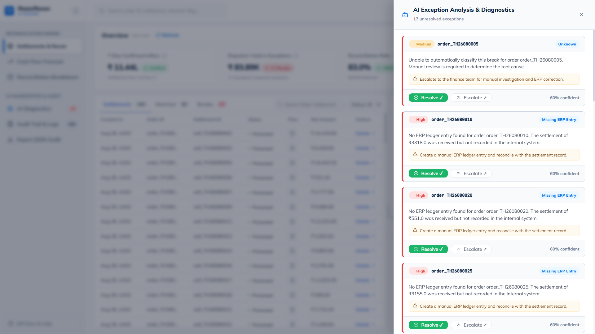
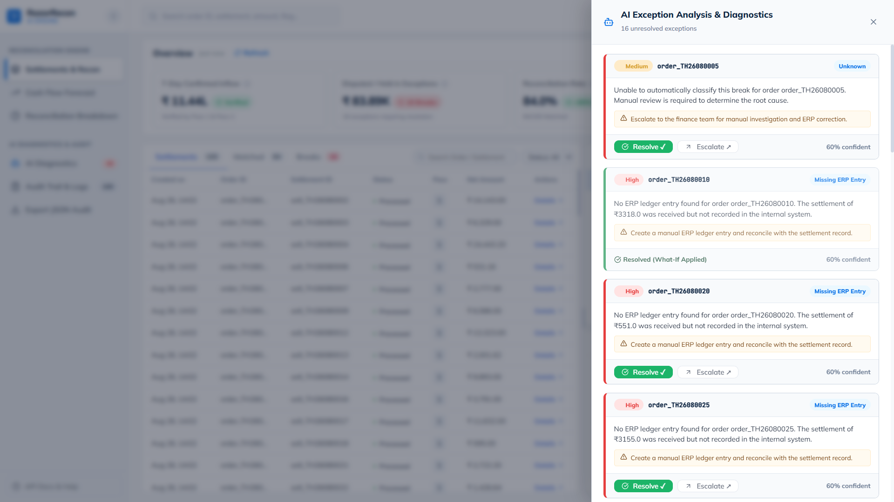
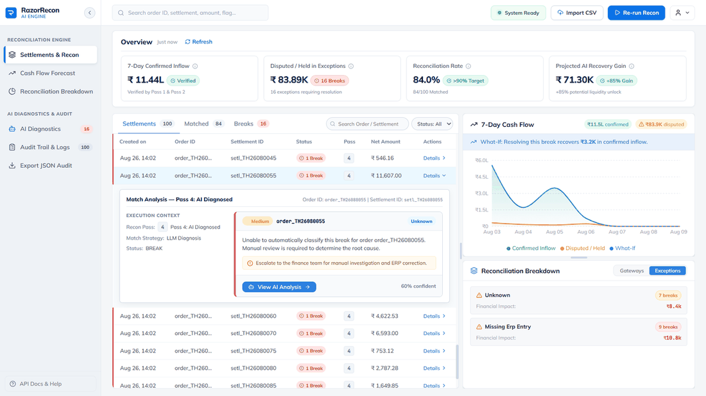
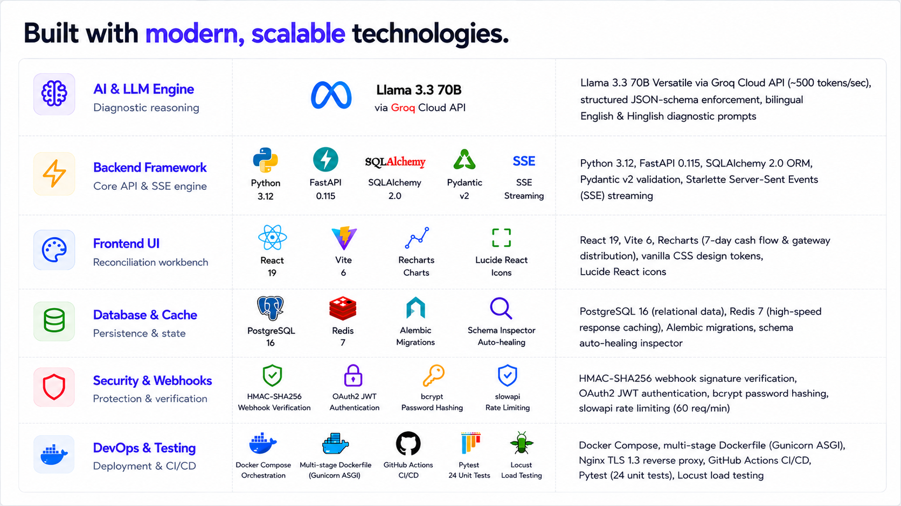
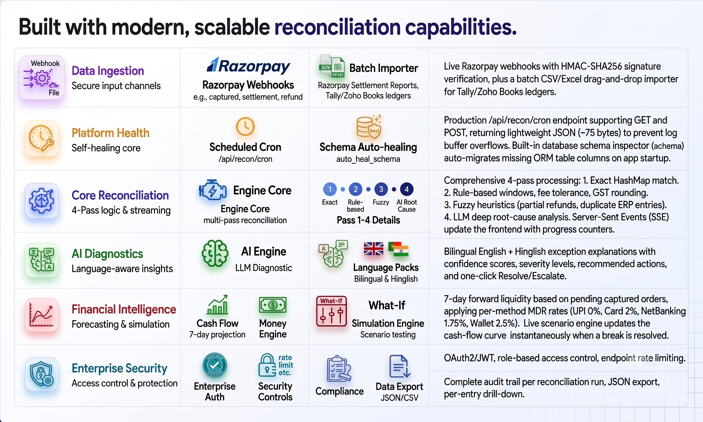

<!-- PROJECT LOGO -->
<div align="center">
  <a href="https://github.com/Devesh-chandan/RazorRecon-AI-Autonomous-Settlement-Reconciliation-Cash-Flow-Prescriber">
    
  </a>
  <br />
  <br />
  <a href="https://github.com/Devesh-chandan/RazorRecon-AI-Autonomous-Settlement-Reconciliation-Cash-Flow-Prescriber">
    
  </a>

  <h1 align="center">RazorRecon</h1>

  <p>
    <strong>LLM-Powered Autonomous Settlement Reconciliation & Cash-Flow Prescriber</strong>
    <br />
    Ingest live Razorpay webhooks and bulk settlement CSVs. Reconcile net bank payouts against
    internal ERP ledgers with a 4-pass hybrid engine. Diagnose complex breaks in English and
    Hinglish with Llama 3.3 70B. Project 7-day forward cash flow with real-time "What-If" simulations.
    <br />
    <br />
    <a href="https://razor-recon-ai-autonomous-settlemen.vercel.app/" target="_blank"><strong>🌐 Live Demo</strong></a>
    ·
    <a href="#-product-tour"><strong>See it in action</strong></a>
    ·
    <a href="#-quickstart"><strong>Get started</strong></a>
    ·
    <a href="http://localhost:8000/docs"><strong>API Docs</strong></a>
    ·
    <a href="PROBLEMS_AND_SOLUTIONS.md"><strong>Troubleshooting</strong></a>
  </p>
</div>

<p align="center">
  <a href="https://razor-recon-ai-autonomous-settlemen.vercel.app/" target="_blank"></a>
  <a href="https://github.com/Devesh-chandan/RazorRecon-AI-Autonomous-Settlement-Reconciliation-Cash-Flow-Prescriber"></a>
  <a href="https://github.com/Devesh-chandan/RazorRecon-AI-Autonomous-Settlement-Reconciliation-Cash-Flow-Prescriber"></a>
  <a href="https://github.com/Devesh-chandan/RazorRecon-AI-Autonomous-Settlement-Reconciliation-Cash-Flow-Prescriber/actions/workflows/ci.yml"></a>
  <a href="https://github.com/Devesh-chandan/RazorRecon-AI-Autonomous-Settlement-Reconciliation-Cash-Flow-Prescriber/blob/main/LICENSE"></a>
</p>

<p align="center">
  
  
  
  
  
  
  
  
  
</p>

---

## 📊 Quantified Impact — How RazorRecon Solves the Problem

These are structural, architecture-level metrics — how the engine is built to perform — not
numbers pulled from any one demo run. Actual results scale with your own transaction volume.

| Problem | Without RazorRecon | With RazorRecon |
| --- | --- | --- |
| ⏱️ **Manual reconciliation effort** | 20–40 hrs/week of spreadsheet cross-checking per merchant | Full audit run completes in seconds, streamed pass-by-pass over SSE |
| 🔁 **Break-detection depth** | Single flat comparison misses date-shifted, fee-adjusted, or duplicate entries | 4 sequential passes — exact match → T+1/T+2 rule-based windows (±₹5 MDR tolerance, UTC/IST shift, GST rounding) → fuzzy heuristics (partial refunds, ~2% variance typos, duplicate ERP rows) → LLM deep diagnosis — so each pass catches what the previous one structurally cannot |
| 🧠 **Root-cause turnaround** | Hours of manual log/spreadsheet tracing per unresolved break | LLM diagnosis at ~500 tokens/sec (Groq-hosted Llama 3.3 70B) returns a structured, confidence-scored explanation per break in seconds |
| 🌐 **Language accessibility** | English-only tooling excludes regional finance staff | Diagnostics generated natively in English *and* Hinglish, same latency, same confidence score |
| 🔮 **Cash-flow forecast accuracy** | Flat/blended payout estimates ignore payment-method economics | 7-day projection applies exact per-method MDR (UPI 0%, Card 2%, NetBanking 1.75%, Wallet 2.5%) instead of a single blended rate |
| 🧪 **Engineering reliability** | Unverified against concurrency or edge cases | 24 automated unit tests + Locust-verified throughput at 100–500 concurrent simulated users |
| 🐞 **Production hardening** | — | 33 real webhook, database, and UI failure modes identified, root-caused, and fixed — logged in [`PROBLEMS_AND_SOLUTIONS.md`](PROBLEMS_AND_SOLUTIONS.md) |
| 🔐 **Data integrity** | Unsigned webhook payloads are spoofable | Every webhook cryptographically verified via HMAC-SHA256 before it touches the ledger |

---

## 📍 Table of Contents

<details open>
<summary><strong>Click to expand / collapse navigation menu</strong></summary>
<br />

| Overview & Architecture | Developer & Ingestion Setup | Operations, Deployment & License |
|---|---|---|
| 💡 [What is RazorRecon?](#-what-is-razorrecon) | 🚀 [Quickstart Guide](#-quickstart) | 📖 [API Reference](#-api-reference) |
| 📊 [Quantified Impact](#-quantified-impact--how-razorrecon-solves-the-problem) | 🔌 [Ports & Services](#-ports--services) | 🗄️ [Database & Cache Inspection](#-database--cache-inspection) |
| 🎯 [Is RazorRecon a Fit?](#-is-razorrecon-a-fit) | 📥 [Data Ingestion Pipelines](#-data-ingestion-pipelines) | 🐳 [Production Deployment](#-production-deployment) |
| 🎬 [Product Tour](#-product-tour) | 🔐 [Authentication](#-authentication) | 🧪 [Testing & Quality Assurance](#-testing--quality-assurance) |
| 🏗️ [Architecture](#️-architecture) | | 📁 [Repository Structure](#-repository-structure) |
| 🛠️ [Technology Stack](#️-technology-stack) | | 🔧 [Troubleshooting](#-troubleshooting) |
| 📋 [Platform Capabilities](#-platform-capabilities) | | 🏆 [Project Info & License](#-project-info--license) |

</details>

---

## 💡 What is RazorRecon?

Razorpay merchants receive daily **net settlements** that lump captured orders, MDR gateway fees,
18% GST on MDR, refunds, and chargebacks into single bulk bank credits. Matching these net payout
rows against internal ERP order books across T+1/T+2 settlement cycles is:

| Problem | Impact |
| --- | --- |
| ⏳ **Time-intensive** | Mid-sized merchants spend 20–40 hours per week manually auditing spreadsheets |
| ⚠️ **Error-prone** | Human error leads to unrecorded breaks, missed tax deductions, and duplicate ledger entries |
| 🌫️ **Cash-opaque** | Unresolved breaks obscure usable operating capital and forward liquidity |

**RazorRecon** is an autonomous AI financial controller that solves this end-to-end — from raw
webhook events and CSV uploads, through 4-pass reconciliation, to AI-powered diagnostics and
7-day forward cash-flow projection.

## 🎯 Is RazorRecon a Fit?

| Question | Answer |
| --- | --- |
| **What is it best for?** | Merchants and finance teams reconciling Razorpay net settlements against an ERP ledger, and forecasting short-term liquidity from unresolved breaks. |
| **What is it not?** | A general ledger/accounting system, a payment gateway, or a replacement for Tally/Zoho Books — it reconciles against them. |
| **How mature is it?** | Built for the Razorpay Buildathon 2026 (Track 04 — AI Finance Controller). Ships with a 100-record benchmark seed dataset, a Pytest suite, and a Locust load benchmark. Review [`PROBLEMS_AND_SOLUTIONS.md`](PROBLEMS_AND_SOLUTIONS.md) before extending it further. |

---

## 🎬 Product Tour

<details open>
<summary><strong>Reconciliation Workbench & Live Engine</strong></summary>

The main workbench initializes in a clean idle state with metric placeholders and 4-pass pipeline
cards ready for execution. Triggering reconciliation streams progress in real time over
Server-Sent Events, and a completed audit surfaces the key financial metrics — 7-Day Confirmed
Inflow (₹11.44L), Disputed Exceptions (₹83.89K), 83.0% Recon Rate, and Projected AI Recovery Gain
(₹71.30K).

| Idle State | Engine Running | Results Overview |
| --- | --- | --- |
|  |  |  |

Expanding a matched row reveals its exact execution context — recon pass, matching strategy, and
the matched order/settlement IDs.

<p align="center">
  
</p>

</details>

<details>
<summary><strong>Data Import — CSV & Excel Batch Ingestion</strong></summary>

A drag-and-drop modal ingests official Razorpay Settlement Reports and Tally/Zoho Books ERP sales
ledgers (`.csv` and `.xlsx`, up to 50 MB), then returns a post-import summary showing rows read,
records imported vs. duplicates skipped, and one-click actions to audit all records or only the
newly imported batch.

| Import Modal | Import Summary |
| --- | --- |
|  |  |

</details>

<details>
<summary><strong>Cash Flow Forecasting & What-If Simulation</strong></summary>

A dedicated liquidity page projects the 7-day cash inflow trend, gateway holdback risk, and a
daily liquidity breakdown table. Hovering over a forecast node shows the exact confirmed inflow
vs. disputed-exception holdback for that day, and simulating a break's resolution overlays a blue
dashed "What-If" curve showing the recovered liquidity (+₹3.2K).

| 7-Day Forecast Page | Tooltip Detail | What-If Curve |
| --- | --- | --- |
|  |  |  |

</details>

<details>
<summary><strong>Reconciliation Breakdown & Root-Cause Actions</strong></summary>

The breakdown view shows gateway volume allocation (HDFC Bank PG 43.8%, Razorpay Stack 23.1%,
ICICI Direct 20.3%, Axis UPI Express 11.2%, PhonePe 1.5%) and isolates exception root causes with
financial impact deltas, priority badges, and recommended next steps.

| Gateway Performance Matrix | Exception Root Causes |
| --- | --- |
|  |  |

</details>

<details>
<summary><strong>Bilingual AI Diagnostics (English & Hinglish)</strong></summary>

A side drawer lists every unresolved exception with LLM confidence scores, root-cause
explanations, and one-click `Resolve`/`Escalate` actions. Resolving a break through the What-If
engine updates its status to `Resolved (What-If Applied)` with a green confirmation badge.
Diagnostics can be toggled between English and natural Hinglish
(*"Order order_TH26080055 ka break automatically classify nahi ho saka. Manual review zarori
hai."*).

| Exception Drawer (Unresolved) | Resolved via What-If | Break Detail (Pass 4) |
| --- | --- | --- |
|  |  |  |

| English Mode | Hinglish Mode |
| --- | --- |
|  |  |

</details>

<details>
<summary><strong>Audit Trail & Merchant Profile</strong></summary>

Every reconciliation run produces a complete, filterable audit log (by Recon Pass 1–4 and status
`matched`/`break`) with JSON export. The top navigation exposes the active Merchant ID
(`MID4823099`), an `EN`/`HI` language switcher, a Test Mode indicator, and a direct link to the
API docs.

| Audit Trail & Execution Log | Profile & Language Menu |
| --- | --- |
|  |  |

</details>

---

## 🏗️ Architecture

```
┌─────────────────────────────────────────────────────────────────────────────┐
│                           PRODUCTION CLOUD PIPELINE                         │
│                                                                             │
│ ┌──────────────────────┐      ┌──────────────────┐      ┌─────────────────┐ │
│ │ Vercel / Cloudflare  │ ---> │ AWS ECS / Render │ ---> │ AWS RDS Postgres│ │
│ │ React 19 Frontend    │      │ Gunicorn FastAPI │      │ SSL Managed DB  │ │
│ └──────────────────────┘      └────────┬─────────┘      └─────────────────┘ │
│                                        │                                    │
│ ┌──────────────────────┐               │                ┌─────────────────┐ │
│ │ Razorpay Webhooks    │ ──────────────┼──────────────> │ Upstash Redis   │ │
│ │ Live Payment Events  │               │                │ Managed Cache   │ │
│ └──────────────────────┘               ▼                └─────────────────┘ │
│                               ┌──────────────────┐                          │
│                               │ Groq Cloud API   │                          │
│                               │ Llama 3.3 70B    │                          │
│                               └──────────────────┘                          │
└─────────────────────────────────────────────────────────────────────────────┘
```

---

## 🛠️ Technology Stack

<p align="center">
  
</p>

| Layer | Component | Technologies & Architecture |
| --- | --- | --- |
| 🧠 **AI & LLM Engine** | Diagnostic reasoning | **Llama 3.3 70B Versatile** via **Groq Cloud API** (~500 tokens/sec), structured JSON-schema enforcement, bilingual English & Hinglish diagnostic prompts |
| ⚡ **Backend Framework** | Core API & SSE engine | **Python 3.12**, **FastAPI 0.115**, **SQLAlchemy 2.0** ORM, **Pydantic v2** validation, Starlette Server-Sent Events (SSE) streaming |
| 🎨 **Frontend UI** | Reconciliation workbench | **React 19**, **Vite 6**, **Recharts** (7-day cash flow & gateway distribution), vanilla CSS design tokens, Lucide React icons |
| 🗄️ **Database & Cache** | Persistence & state | **PostgreSQL 16** (relational data), **Redis 7** (high-speed response caching), **Alembic** migrations, schema auto-healing inspector |
| 🔐 **Security & Webhooks** | Protection & verification | **HMAC-SHA256** webhook signature verification, **OAuth2 JWT** authentication, `bcrypt` password hashing, `slowapi` rate limiting (60 req/min) |
| 🐳 **DevOps & Testing** | Deployment & CI/CD | **Docker Compose**, multi-stage Dockerfile (Gunicorn ASGI), Nginx TLS 1.3 reverse proxy, GitHub Actions CI/CD, Pytest (24 unit tests), Locust load testing |

---

## 📋 Platform Capabilities

<p align="center">
  
</p>

| Capability | What it covers |
| --- | --- |
| **Ingest production data** | Live Razorpay webhooks (`payment.captured`, `settlement.processed`, `refund.processed`) with HMAC-SHA256 signature verification, plus a batch CSV/Excel drag-and-drop importer for Razorpay Settlement Reports and Tally/Zoho Books ledgers |
| **Scheduled cron trigger** | Production `/api/recon/cron` endpoint supporting both `GET` and `POST`, returning a lightweight JSON payload (~75 bytes) so hosting-platform log buffers don't overflow while reconciliation runs in the background |
| **Schema auto-healing** | Built-in database schema inspector (`auto_heal_schema`) auto-migrates missing ORM table columns (`gateway`, `import_source`, `refund_amount`) on app startup without data loss |
| **4-pass reconciliation** | Pass 1 — exact deterministic HashMap match. Pass 2 — rule-based T+1/T+2 date windows, MDR fee tolerance ±₹5, UTC/IST shifts, GST rounding. Pass 3 — fuzzy heuristics for partial refunds, 2% variance typos, duplicate ERP entries. Pass 4 — LLM deep root-cause analysis |
| **AI diagnostics** | Bilingual English + Hinglish exception explanations with confidence scores, severity levels, recommended actions, and one-click Resolve/Escalate |
| **Cash-flow projection** | 7-day forward liquidity based on pending captured orders, applying per-method MDR rates (UPI 0%, Card 2%, NetBanking 1.75%, Wallet 2.5%) |
| **What-If simulation** | Live scenario engine that updates the cash-flow curve instantaneously when a break is resolved |
| **Real-time streaming** | Server-Sent Events (SSE) update the frontend pass-by-pass with animated progress counters |
| **Enterprise auth** | OAuth2/JWT, role-based access control, endpoint rate limiting |
| **Audit & export** | Complete audit trail per reconciliation run, JSON export, per-entry drill-down |

---

## 🚀 Quickstart

### Prerequisites

- [Python 3.12+](https://www.python.org/)
- [Node.js 20+](https://nodejs.org/)
- [Docker Desktop](https://www.docker.com/products/docker-desktop/) (for containerized DB & Redis)
- A free Groq Cloud API key from [console.groq.com](https://console.groq.com)

### 1. Clone & start infrastructure

```bash
git clone https://github.com/Devesh-chandan/RazorRecon-AI-Autonomous-Settlement-Reconciliation-Cash-Flow-Prescriber.git
cd RazorRecon-AI-Autonomous-Settlement-Reconciliation-Cash-Flow-Prescriber

# Start PostgreSQL and Redis containers
docker compose up -d
```

### 2. Backend setup & database migration

```bash
cd backend

# Create & activate virtual environment (Windows PowerShell)
python -m venv .venv
.venv\Scripts\activate

# Install Python dependencies
pip install -r requirements.txt

# Create environment file from template
copy ..\.env.example .env
```

Edit `backend/.env` and update your keys:

```env
GROQ_API_KEY=gsk_your_groq_api_key_here
RAZORPAY_WEBHOOK_SECRET=rzp_whsec_9f8e7d6c5b4a3f2e1d0c9b8a7f6e5d4c
JWT_SECRET_KEY=242fdbce944b413db89346b5206bf59fdaef94ee0483ccb467662353050b9ddd
```

Run database migrations and seed initial data:

```bash
# Run database migrations (creates orders, settlements, erp_ledger, merchants, recon_runs tables)
alembic upgrade head

# Reset database back to clean 100-record benchmark dataset (clears previous data)
python -m app.seed

# Start FastAPI dev server
uvicorn app.main:app --reload --port 8000
```

<details>
<summary><strong>Additional data management commands</strong></summary>

```bash
# Append N additional realistic records WITHOUT clearing existing DB data
python -m app.seed_append 50     # Appends 50 new records
python -m app.seed_append 500    # Appends 500 new records

# Clear ALL records from database completely (0-record state)
python -m app.reset

# Simulate live HMAC-SHA256 signed Razorpay webhooks over ngrok
python -m app.send_test_webhook
```

</details>

### 3. Frontend setup

In a new terminal:

```bash
cd frontend
npm install
npm run dev
```

Open **`http://localhost:5173`** in your browser.

### 4. Wire up live Razorpay webhooks (local tunneling)

Razorpay's servers need a public HTTPS endpoint to reach your local machine.

<details>
<summary><strong>Using ngrok</strong></summary>

```bash
ngrok http 8000
```

Copy the forwarding URL (e.g. `https://pursuit-parcel-coat.ngrok-free.dev`).

</details>

<details>
<summary><strong>Using localtunnel (no signup required)</strong></summary>

```bash
npx localtunnel --port 8000
```

</details>

**Configure the Razorpay Dashboard:**

1. Go to **Razorpay Dashboard → Account & Settings → Webhooks**.
2. Click **+ Add New Webhook**.
3. Set the webhook URL to `https://<your-tunnel-subdomain>.ngrok-free.dev/api/webhooks/razorpay`.
4. Enter secret `rzp_whsec_9f8e7d6c5b4a3f2e1d0c9b8a7f6e5d4c` (must match `RAZORPAY_WEBHOOK_SECRET` in `.env`).
5. Select active events: `payment.captured`, `settlement.processed`, `refund.processed`.
6. Save. Live events are now parsed, verified, and saved to PostgreSQL automatically.

**Quick live webhook test (simulator):**

```bash
python -m app.send_test_webhook
```

---

## 🔌 Ports & Services

| Port | Service | URL | Purpose |
| :---: | --- | --- | --- |
| `5173` | React 19 frontend | [http://localhost:5173](http://localhost:5173) | Main dashboard UI |
| `8000` | FastAPI backend | [http://localhost:8000](http://localhost:8000) | REST API & SSE stream |
| `8000` | Swagger docs | [http://localhost:8000/docs](http://localhost:8000/docs) | Interactive API documentation |
| `8000` | ReDoc | [http://localhost:8000/redoc](http://localhost:8000/redoc) | OpenAPI spec view |
| `443` | Nginx TLS proxy | `https://localhost` | Production SSL reverse proxy |
| `5432` | PostgreSQL | `postgresql://localhost:5432` | Relational database |
| `6379` | Redis | `redis://localhost:6379` | Cash-flow & recon results cache |

---

## 📥 Data Ingestion Pipelines

### 1. Live webhook listener — `POST /api/webhooks/razorpay`

Verifies `X-Razorpay-Signature` using HMAC-SHA256 and automatically handles:

- `payment.captured` → inserts into `orders`
- `settlement.processed` → inserts into `settlements`
- `refund.processed` → updates order status to `refunded`

### 2. Batch CSV & Excel importer — `POST /api/recon/upload`

Ingests official Razorpay Settlement Reports (`.csv`, `.xlsx`) or ERP ledgers. Accepts
`multipart/form-data` with `file` and `source` (`razorpay_settlement` or `erp_ledger`). Auto-maps
headers, skips duplicate rows, and returns a JSON summary:

```json
{
  "source": "razorpay_settlement",
  "rows_read": 500,
  "rows_imported": 498,
  "rows_skipped": 2,
  "errors": []
}
```

Sample datasets and audit-log exports are included in [`samples/`](samples/):

- [`samples/sample_razorpay_settlements.csv`](samples/sample_razorpay_settlements.csv) — sample Razorpay settlement report
- [`samples/sample_erp_ledger.csv`](samples/sample_erp_ledger.csv) — sample ERP sales ledger file
- [`samples/sample_audit_log_export.json`](samples/sample_audit_log_export.json) — sample JSON audit-log export

### 3. Production cron reconciliation trigger — `GET`/`POST /api/recon/cron`

Designed for cloud cron job providers (e.g. `cron-job.org`, Render Cron, GitHub Actions, AWS
EventBridge). Accepts both `GET` and `POST` and returns a lightweight HTTP 200 JSON status
response (~75 bytes) to prevent response-buffer overflows while reconciliation executes
asynchronously in the background:

```json
{
  "status": "ok",
  "message": "Reconciliation job started",
  "run_id": "c71a39f6-1234-4567-89ab-cdef01234567"
}
```

Included runner script: [`scripts/cron_recon.sh`](scripts/cron_recon.sh).

---

## 🔐 Authentication

| Method | Endpoint | Description |
| --- | --- | --- |
| `POST` | `/api/auth/register` | Creates a new merchant account with hashed password (`bcrypt`) |
| `POST` | `/api/auth/token` | OAuth2 login endpoint; returns a JWT valid for 8 hours |
| `GET` | `/api/auth/me` | Returns the current authenticated merchant profile (requires `Bearer <token>`) |

---

## 📖 API Reference

Interactive Swagger documentation is available at **`http://localhost:8000/docs`** whenever the
backend is running.

| Method | Endpoint | Description |
| --- | --- | --- |
| `POST` | `/api/webhooks/razorpay` | Live webhook listener — HMAC-SHA256 signature verification |
| `POST` | `/api/recon/upload` | Batch importer — `.csv` / `.xlsx` ingestion |
| `GET`/`POST` | `/api/recon/cron` | Lightweight cron trigger — HTTP 200 response (~75 bytes) |
| `POST` | `/api/auth/register` | Register new merchant user |
| `POST` | `/api/auth/token` | OAuth2 password login, returns JWT |
| `GET` | `/api/auth/me` | Current authenticated user profile |
| `POST` | `/api/recon/run?scope=all` | Trigger 4-pass reconciliation (`scope=all` or `scope=imported`) |
| `GET` | `/api/recon/stream/{run_id}` | SSE stream — real-time pass-completion events |
| `GET` | `/api/recon/results/{run_id}` | Detailed results for all records from Redis/DB |
| `GET` | `/api/recon/stats/{run_id}` | Aggregated KPIs (match rate %, net payout, break count) |
| `GET` | `/api/cashflow/{run_id}` | 7-day forward cash-flow projection curve |
| `POST` | `/api/cashflow/whatif` | Simulate resolving a break; returns updated cash curve |
| `GET` | `/api/audit/{run_id}` | Complete audit log for a specific run |
| `GET` | `/api/audit/{run_id}/export` | Download full audit log as JSON |
| `GET` | `/api/health` | Health check — DB, Redis, and Groq API status |

---

## 🗄️ Database & Cache Inspection

<details>
<summary><strong>🐘 PostgreSQL (port 5432)</strong></summary>

**Connection:** host `localhost` · port `5432` · database `razorrecon` · user `razorrecon` · password `razorrecon`

**CLI via Docker:**

```bash
docker exec -it razorrecon_postgres psql -U razorrecon -d razorrecon
```

**Useful queries:**

```sql
SELECT count(*) FROM orders;
SELECT count(*) FROM settlements;
SELECT run_id, status, match_rate, created_at FROM recon_runs ORDER BY created_at DESC LIMIT 5;
```

**GUI tools:** connect via TablePlus, DBeaver, pgAdmin, or the VS Code Database Client with the credentials above.

</details>

<details>
<summary><strong>🔴 Redis (port 6379)</strong></summary>

**Connection:** host `localhost` · port `6379` · URL `redis://localhost:6379/0`

**CLI via Docker:**

```bash
docker exec -it razorrecon_redis redis-cli
```

**Useful commands:**

```redis
PING                            # Returns PONG
KEYS razorrecon:*               # Inspect all cached reconciliation runs
GET razorrecon:results:<run_id> # Retrieve cached JSON result for a run
```

**GUI tools:** use [RedisInsight](https://redis.io/insight/) → Add Database → host `localhost`, port `6379`.

</details>

---

## 🐳 Production Deployment

For a multi-worker, high-availability deployment with Docker Compose + Gunicorn + Nginx:

<details>
<summary><strong>Deployment steps</strong></summary>

**1. Generate a self-signed SSL certificate (or use Let's Encrypt):**

```powershell
New-Item -ItemType Directory -Force -Path ".\nginx\ssl"
openssl req -x509 -newkey rsa:4096 -sha256 -days 365 -nodes `
  -keyout .\nginx\ssl\selfsigned.key -out .\nginx\ssl\selfsigned.crt `
  -subj "/CN=localhost/O=RazorRecon/C=IN"
```

**2. Build and launch the production stack:**

```bash
docker-compose -f docker-compose.prod.yml up --build -d
```

This launches:

- **`backend`** — Gunicorn running 4 Uvicorn worker processes
- **`nginx`** — HTTPS reverse proxy on port 443 with TLS 1.2/1.3, security headers, gzip, and a 60 MB upload limit
- **`postgres`** — internal PostgreSQL container with health checks
- **`redis`** — internal Redis 7 container with password auth

</details>

---

## 🧪 Testing & Quality Assurance

```bash
# Run unit & integration tests
pytest tests/ -v

# Run security vulnerability audit
bandit -r backend/

# Run load & concurrency benchmark (100–500 concurrent users)
locust -f tests/locustfile.py --headless -u 100 -r 10 --run-time 60s --host http://localhost:8000
```

---

## 📁 Repository Structure

```
RazorRecon-AI/
├── .github/
│   └── workflows/
│       └── ci.yml            # GitHub Actions automated test & build pipeline
├── backend/
│   ├── alembic/               # Database migration scripts
│   │   └── versions/          # Migration revisions (0001_initial, 0002_add_merchants, 0003_add_gateway_fields)
│   ├── app/
│   │   ├── auth/               # JWT auth, bcrypt password hashing, RBAC dependencies
│   │   ├── engine/              # 4-Pass reconciliation core (pass1-4, cashflow, reconcile)
│   │   ├── llm/                  # Groq client & diagnostic prompts
│   │   ├── routes/               # FastAPI routers (recon, cashflow, audit, auth, ingestion, health)
│   │   ├── config.py              # Settings & environment variables
│   │   ├── database.py            # SQLAlchemy database session manager & auto_heal_schema inspector
│   │   ├── models.py               # DB ORM schema definitions
│   │   ├── schemas.py              # Pydantic request/response schemas
│   │   ├── cache.py                 # Redis caching implementation
│   │   ├── seed.py                   # Benchmark dataset seeder (100 records, 10 edge cases)
│   │   └── main.py                    # FastAPI entrypoint + slowapi rate limiting + CORS preflight
│   ├── alembic.ini
│   └── requirements.txt
├── frontend/
│   ├── src/
│   │   ├── api/                # API REST & SSE client
│   │   ├── components/          # Workbench, CashFlowChart, AIExceptionDrawer, AuditLog, Modal
│   │   ├── App.jsx
│   │   └── index.css              # Razorpay Design System tokens & styles
│   └── package.json
├── samples/                   # Production sample datasets & JSON audit log exports
│   ├── sample_razorpay_settlements.csv
│   ├── sample_erp_ledger.csv
│   └── sample_audit_log_export.json
├── scripts/
│   └── cron_recon.sh          # Production cron job trigger shell script
├── tests/                     # Pytest & Locust test suite
│   ├── conftest.py             # Path resolver for IDEs & test runners
│   ├── test_cron_logging.py     # Unit tests for cron endpoint & logging configuration
│   ├── test_pass1_exact.py       # Unit tests for Pass 1 exact match logic
│   ├── test_reconcile.py          # Unit tests for Pass 2-3 & multi-pass engine pipeline
│   ├── test_webhook.py             # Unit tests for HMAC-SHA256 webhook verification
│   ├── test_csv_importer.py         # Unit tests for CSV/Excel batch importer (with autouse cleanup)
│   └── locustfile.py                # Concurrency & load benchmark suite
├── nginx/                     # Nginx TLS proxy configuration & SSL cert instructions
├── docs/images/                # README screenshots & architecture diagrams
├── Dockerfile                  # Multi-stage Gunicorn ASGI production container
├── docker-compose.yml           # Development PostgreSQL 16 & Redis 7
├── docker-compose.prod.yml       # Production stack (backend + nginx + postgres + redis)
├── Makefile                       # Developer & judge command shortcuts (make dev, make test)
├── quickstart.sh                   # 1-click automated setup script for judges
├── LICENSE                          # MIT License
├── PROBLEMS_AND_SOLUTIONS.md         # Complete problem, root-cause & solution log
├── pytest.ini
├── .env.example
└── README.md
```

---

## 🔧 Troubleshooting

For a complete record of every technical issue encountered during integration and webhook
troubleshooting, along with the exact fix applied, see
[`PROBLEMS_AND_SOLUTIONS.md`](PROBLEMS_AND_SOLUTIONS.md).

---

## 🏆 Project Info & License

| Field | Value |
| --- | --- |
| **Live Demo** | [razor-recon-ai-autonomous-settlemen.vercel.app](https://razor-recon-ai-autonomous-settlemen.vercel.app/) |
| **Hackathon / Track** | Razorpay Buildathon 2026 — Track 04 (AI Finance Controller) |
| **Model** | Llama 3.3 70B Versatile (via Groq Cloud API) |
| **License** | [MIT](LICENSE) |
| **Author** | Devesh Chandan |

Contributions, issues, and feature requests are welcome — please open an issue or pull request on
[GitHub](https://github.com/Devesh-chandan/RazorRecon-AI-Autonomous-Settlement-Reconciliation-Cash-Flow-Prescriber).

---

<p align="center">
  <i>Built with ❤️ for Razorpay Buildathon 2026</i>
</p>